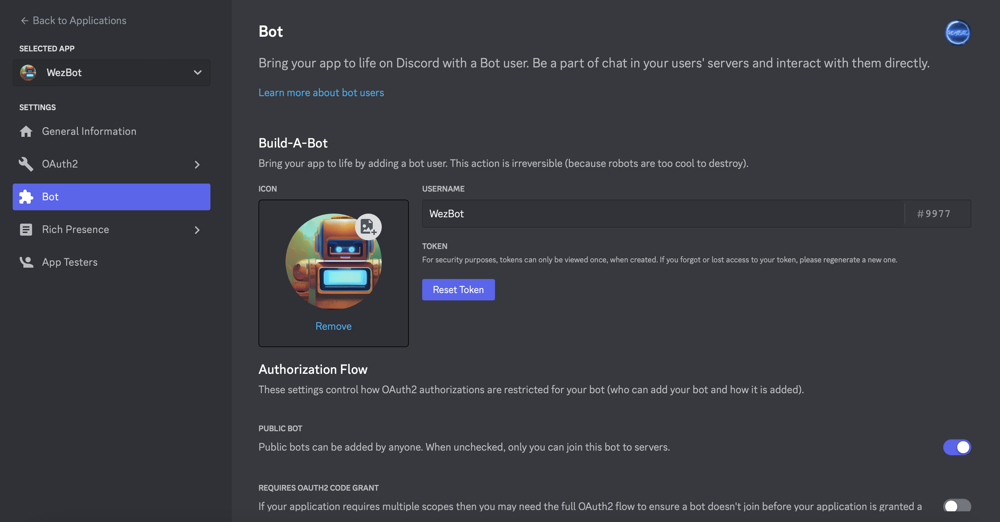
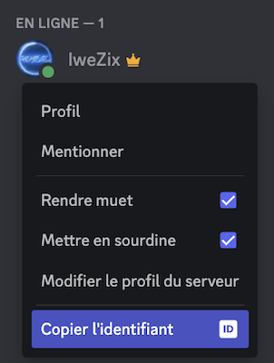

<!-- Banner -->
<div align="center">
    
</div>

<h1 align="center">Hi There, Welcome to WezBot repository ! </h1>
<h3 align="center">A multifunctional French bot</h3>

<!-- Badges -->
<div align="center">
    <a href="https://img.shields.io/github/license/IweZix/WezBot"></a>
    <a href="https://img.shields.io/github/forks/IweZix/WezBot"></a>
    <a href="https://img.shields.io/github/languages/count/IweZix/WezBot"></a>
    <a href="https://img.shields.io/github/issues-pr/IweZix/WezBot"></a>
</div>

<!-- Presentation -->
# 📜 Presentation
WezBot is a multifunction bot that takes over the commands necessary for the proper functioning of a Discord server. It also has a system of temporary voice and text channels. For convenience, you can directly [add](https://discord.com/api/oauth2/authorize?client_id=1049396684075053077&permissions=8&scope=applications.commands%20bot) WezBot to your server.

[Installation](#🛠️-installation) is quick and easy

<!-- Languages and Tools -->
# 🚧 Prerequisites
- [Node.js 16+](https://nodejs.org/en/download/)
- [discord.js@14.7.1](https://www.npmjs.com/package/discord.js/v/14.7.1)

<!-- Installation -->
# 🛠️ Installation
> To install the bot, you must first clone the repository OR download the last [release](https://github.com/IweZix/WezBot/releases) :
```javascript
git clone https://github.com/IweZix/WezBot.git
```
> Then, you must install the dependencies :
```javascript
npm i
```
> Finally, you will need to create config.js file

```javascript
module.exports = {
    token: "YOUR_TOKEN",
    ownerID: "YOUR_ID",
    version: "YOUR_VERSION",
    color: "YOUR_COLOR"
}
```

#### 🔐 Token
<div align="center">
    
</div>

#### 🆔 OwnerID
<div align="center">
    
</div>
<br>

> You can now start the bot :
```javascript
node main.js
```

# 📝 License

WeZbot is licensed under the [GNU GPL v3.0](https://www.gnu.org/licenses/gpl-3.0.en.html)

If you want to use WezBot's code to create your own Discord bot, please upload your new code on GitHub mentioning IweZix

For any questions or requests, please contact me either by Discord **IweZix#8370** or **contact@iwezix.xyz**
